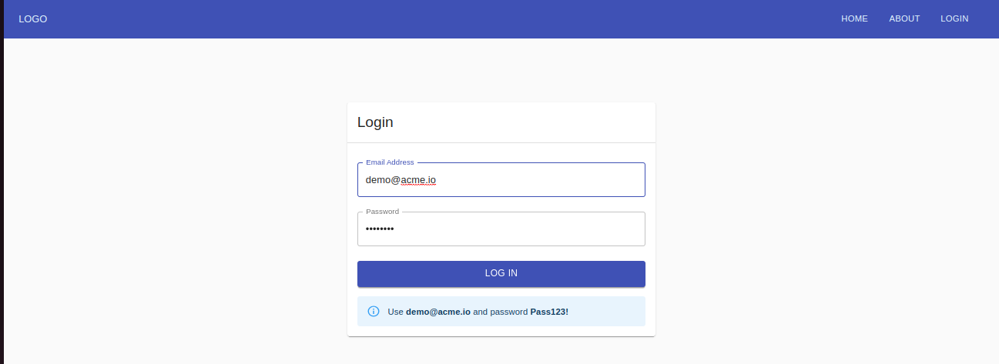
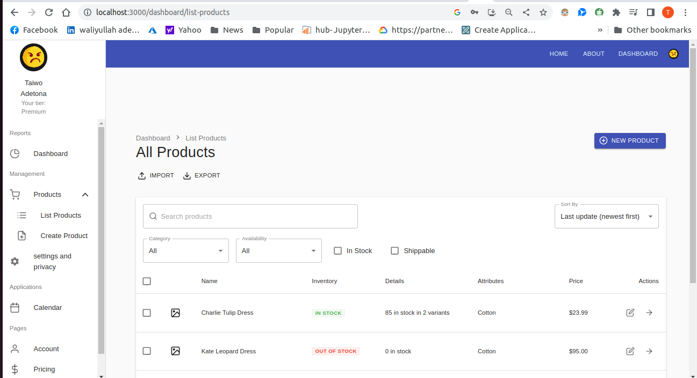
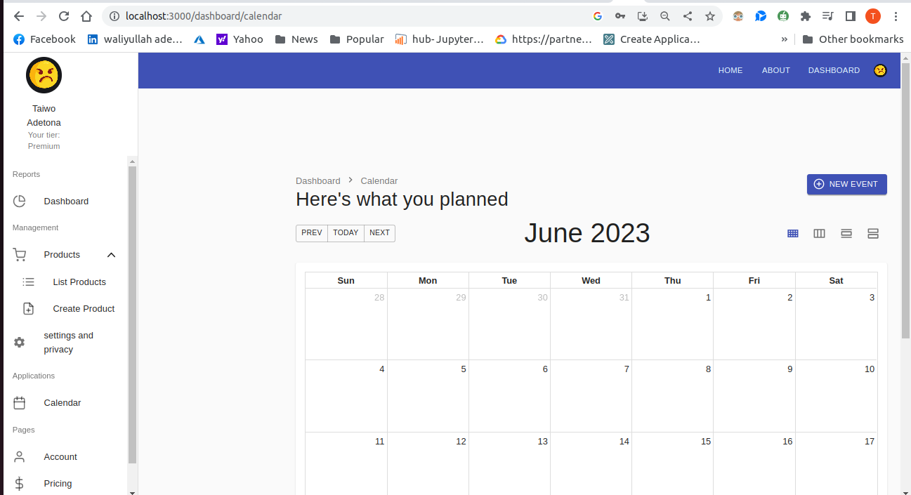

# A Full-Stack enterprise applications

This a project of a practical developing real-world enterprise applications.where you can see list of available product, filter, search, update your profil,e schedule a calendar events.

## video presentation

[https://vimeo.com/839366045?share=copy]

## Built With

- HTML and JSX
- React/Redux
- CSS
- ES6
- TypeScript
- Material UI Design
- Formik
- Husky
- i18next
- json server

## Getting Started:

To get a local copy up and running follow these simple example steps:

1. Under the repository name, click the Clone or download green button.

2. Copy the URL given by clicking the clipboard button.

3. Open a terminal window in your local machine and change the current directory to the one you
   want the clone directory to be made.

4. Type git clone and then paste the URL you previously copied to the clipboard.

5. Open a new terminal window in your local machine and change the current directory to your
   cloned directory.

6. Run `npm install` / `npm i` from the Terminal.

7. after that `npm run build` from the terminal.

8. Finally `npm run start:fullstack`. to run both the frontend and the Backend

## Show your support

Give a ⭐️ if you like this project!

## Authors

👤 Taiwo Adetona

- Github: [@taiwo2](https://github.com/taiwo2)

- LinkedIn: [Taiwo Adetona](https://www.linkedin.com/in/taiwo-adetona/)

- Twitter: [@TaiwoAdetona4](https://twitter.com/TaiwoAdetona4/)

## 🤝 Contributing

Contributions, issues and feature requests are welcome!

Feel free to check the [issues page](../../issues/).

## Show your support

Give a ⭐️ if you like this project!

## Acknowledgments

- Devlin Basilan Duldulao
- Ruby Jane Leyva Cabagnot.

## 📝 License

MIT License
